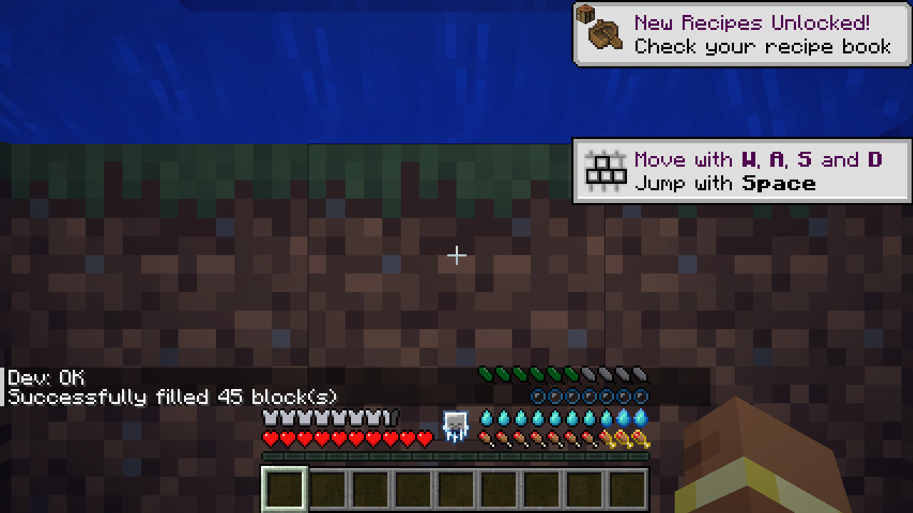

# Green Feathers

**Stamina for Minecraft, as a row of feathers above your food bar.** Sprinting, jumping, and whatever other mods
decide cost feathers. Run out and you can push on for a while, at a price.

Minecraft 1.21.1 · NeoForge · based on Elenai's Feathers


## How it plays

- **Feathers come back on their own**, a little every second, after a short pause once you've spent some.
- **Push past empty.** When you run out you can keep going into red *Strain* feathers. Regeneration pays Strain
  back before anything else, slowly, so overdoing it leaves you drained for a while.
- **Rest to recover.** Standing still, crouching or sitting down (a boat, a horse, or most seats from furniture mods)
  pays Strain back faster. Sleep restores everything.
- **Exhaustion.** Spend absolutely everything and you're exhausted: no exerting yourself until you've caught your
  breath.
- **Weather and climate matter.** Cold weather slows your recovery. Heat makes everything cost double, and the
  Nether, fire and lava also cut your maximum feathers. Fire Resistance or a Potion of Cooling keeps you fresh.
- **Heavy armor weighs you down** (optional). Every piece greys out some feathers you can't use. Netherite is heavy;
  the *Lightweight* enchantment and the *Feather Ring* help.
- **Mounts tire too** (optional). Horses, donkeys, mules and camels have their own feathers, shown instead of yours
  while you ride, in hay-bale colors. Galloping and jumping tire them slowly; an exhausted mount slows down and
  can't jump. Like speed and health, each animal is born with its own stamina, and foals take after their parents.
- **Potions:** Endurance (golden bonus feathers), Energy (faster recovery), Momentum (cheaper actions), Cooling.

On its own, Green Feathers makes sprinting and jumping cost feathers. Install
[Actions of Stamina](https://github.com/Darkona/actions-of-stamina) for attacks, elytra, swimming, shields and
movement mods like ParCool, Paragliders and Better Combat.

## Plays well with others

It stacks neatly with the other bars on the right: food, air bubbles, thirst.

|  |  |
|---|---|
| With Cold Sweat and Thirst Was Taken | Underwater, in iron armor (grey = weight) |

Supported out of the box, each switchable in the config:

| Mod | What it does with feathers |
|---|---|
| Cold Sweat | Your body temperature decides when you're cold or overheating |
| Tough As Nails | Its temperature decides cold and heat; its thirst slows or speeds up recovery |
| Legendary Survival Overhaul | The same, from its temperature and hydration |
| Thirst Was Taken | Being thirsty slows recovery, being well quenched speeds it up |
| Serene Seasons | Winter outdoors is cold, summer sun is hot |
| Curios | The Feather Ring goes in a ring slot |
| AppleSkin, Overflowing Bars | Sit nicely alongside the feathers |

## Configuration

Everything is configurable in `config/feathers/`: how many feathers, how fast they come back, Strain, exhaustion,
each effect, resting, armor weights per item or material, basic sprint/jump costs, mounts, each compat, and the HUD.
Operators can inspect and adjust with `/feathers info|set|reset|max|regen|spend|debug`; `debug` shows what spent
feathers recently, by source.

## For modpack makers

Any creature can be a mount with a datapack. List it in `data/greenfeathers/data_maps/entity_type/mount_stats.json`,
optionally with its own numbers (anything left out uses the config):

```json
{
  "values": {
    "mymod:dragon": { "min_feathers": 40, "max_feathers": 60, "gallop_feathers_per_second": 0.05 }
  }
}
```

Fields: `min_feathers`, `max_feathers`, `regen_feathers_per_second`, `gallop_feathers_per_second`, `gallop_speed`,
`jump_feathers`. The `greenfeathers:mounts` entity tag also works, with the default numbers. Armor weights have a data
map too: `greenfeathers:armor_weight` (item → weight).

## For mod developers

Green Feathers is built to be spent by other mods. Compile against the API jar and treat it as optional:

```groovy
compileOnly "com.darkona.feathers:greenfeathers-api:1.21.1-2.0.0"
```

```java
// A one-off cost. EXEMPT (creative players) also means "go ahead".
if (FeathersAPI.spend(player, MY_DASH, Stamina.ofFeathers(3)).allowed()) dash(player);

// A continuous cost: call every tick while it lasts, stop when it's refused.
if (!FeathersAPI.startDrain(player, MY_GLIDE, Stamina.perTick(1.5)).allowed()) stopGliding(player);
```

Costs can be fractions of a feather. The API also covers pausing regeneration, temporary bonus feathers, rest
bonuses, and hooks for temperature, thirst and weight mods. Its classes are documented;
`com.darkona.feathers.api.FeathersAPI` is the place to start.

## License

[GNU GPL v3](LICENSE).
