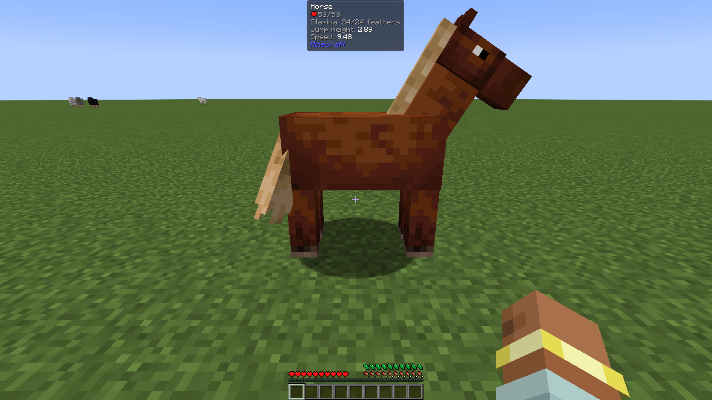

# Compatibility

Feathers of Fatigue stacks neatly with the other bars on the right: food, air bubbles, thirst.

|  |  |
|---|---|
| Thirst Was Taken, Cold Sweat and AppleSkin | Tough As Nails, Serene Seasons and AppleSkin |
|  |  |
| Underwater in iron armor: feathers above the air bubbles | Jade shows a mount's stamina |

Supported out of the box, each with its own switch in `FeathersOfFatigue-Compat.toml`:

| Mod | What it does with feathers |
|---|---|
| Cold Sweat | Your body temperature decides when you're cold or overheating |
| Tough As Nails | Its temperature decides cold and heat; its thirst slows or speeds up recovery |
| Legendary Survival Overhaul | The same, from its temperature and hydration |
| Thirst Was Taken | Being thirsty slows recovery, being well quenched speeds it up |
| Serene Seasons | Winter outdoors is cold, summer sun is hot |
| Curios | The Feather Ring goes in a ring slot |
| Jade | Shows a mount's stamina when you look at it |
| AppleSkin, Overflowing Bars | Sit nicely alongside the feathers |

Mods that change what the player does (ParCool, Paragliders, Better Combat, Combat Roll, Epic Fight, Wall-Jump TXF, Gliders) are covered by [Actions of Stamina](https://github.com/Darkona/actions-of-stamina), which spends feathers for them.

## Versions

Feathers of Fatigue calls into these mods directly, so it accepts the versions it was tested with, up to the next major version. With a version outside that range, the game stops at load and names the mod and the range, instead of crashing later in the middle of play.

| Mod | Accepted versions (1.20.1) |
|---|---|
| Cold Sweat | 2.4.3.2 up to 3 |
| Tough As Nails | 9.2.0.171 up to 10 |
| Legendary Survival Overhaul | 1.20.1-2.4.7 up to 1.20.1-3 |
| Thirst Was Taken | 1.20.1-1.4.0 up to 1.20.1-2 |
| Serene Seasons | 9.1.0.3 up to 10 |
| Curios | 5.14.1 up to 6 |
| Jade | 11.13.3 up to 12 |
| Overflowing Bars | 8.0.1 up to 9 |
