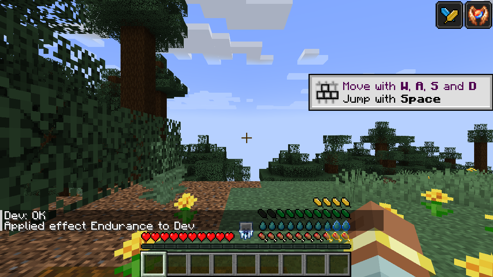

# Compatibility

Green Feathers stacks neatly with the other bars on the right: food, air bubbles, thirst.

|  |  |
|---|---|
| With Cold Sweat and Thirst Was Taken | Underwater, in iron armor (grey = weight) |

Supported out of the box, each with its own switch in `Feathers-Compat.toml`:

| Mod | What it does with feathers |
|---|---|
| Cold Sweat | Your body temperature decides when you're cold or overheating |
| Tough As Nails | Its temperature decides cold and heat; its thirst slows or speeds up recovery |
| Legendary Survival Overhaul | The same, from its temperature and hydration |
| Thirst Was Taken | Being thirsty slows recovery, being well quenched speeds it up |
| Serene Seasons | Winter outdoors is cold, summer sun is hot |
| Curios | The Feather Ring goes in a ring slot |
| Jade | Shows a mount's stamina when you look at it |
| AppleSkin, Overflowing Bars | Sit nicely alongside the feathers |

Mods that change what the player does (ParCool, Paragliders, Better Combat, Combat Roll, Epic Fight, Wall-Jump TXF,
Gliders) are covered by [Actions of Stamina](https://github.com/Darkona/actions-of-stamina), which spends feathers
for them.
