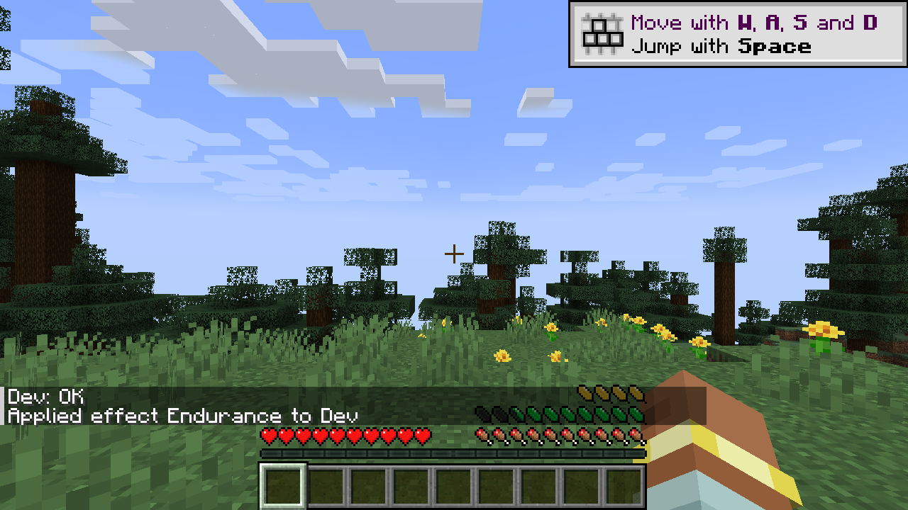

# Feathers of Fatigue

**Stamina for Minecraft, as a row of feathers above your food bar.** Sprinting, jumping, and whatever other mods decide cost feathers. Run out and you can push on for a while, at a price.

Minecraft 1.21.11 · NeoForge 21.11.45 or later · based on Elenai's Feathers. Also for 26.3, 26.2, 26.1.2 and 1.21.1 (NeoForge) and 1.20.1, 1.19.2 and 1.18.2 (Forge): see [Minecraft Versions](Minecraft-Versions) for what differs.

## Pages

- [How It Plays](How-It-Plays): feathers, strain, exhaustion, resting, climate, armor weight, mounts, potions.
- [Compatibility](Compatibility): the mods Feathers of Fatigue works with out of the box.
- [Configuration](Configuration): every config file and option, and the `/feathers` command.
- [Modpack Makers](Modpack-Makers): mounts, armor weights and opt-outs with datapacks.
- [Mod Developers](Mod-Developers): spending feathers and hooking into them from your own mod.
- [Resource Packs](Resource-Packs): recoloring the feathers, or drawing your own.
- [Minecraft Versions](Minecraft-Versions): what is different on each Minecraft version.
