# How It Plays

## Feathers

Feathers sit above the food bar, two per icon, like hearts. A full row is 20 feathers; more than that is drawn as layers over the same row, each a shade deeper (or lighter) than the one below, with a count next to it.

Feathers come back on their own, a little every second, after a short pause once you've spent some. Spending several times in a row lengthens the pause, up to a limit.

The color is yours to pick in the client config: green, blue (like Elenai's original) or white (chicken feathers).

| 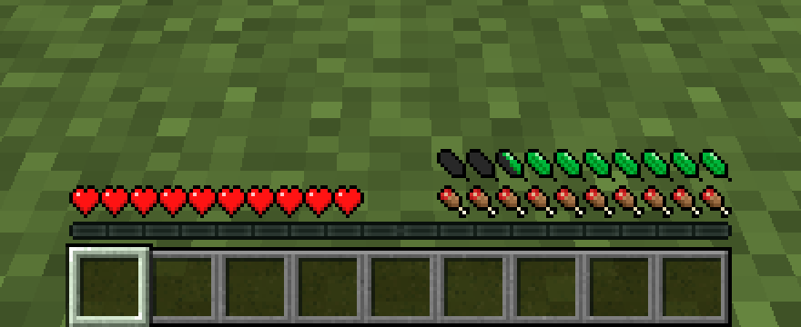 | 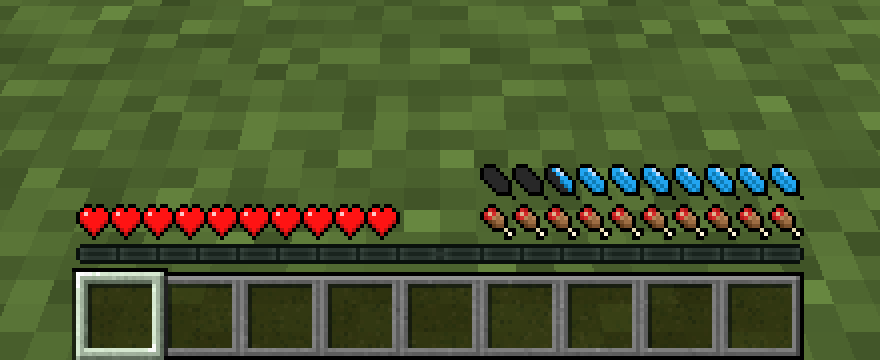 | 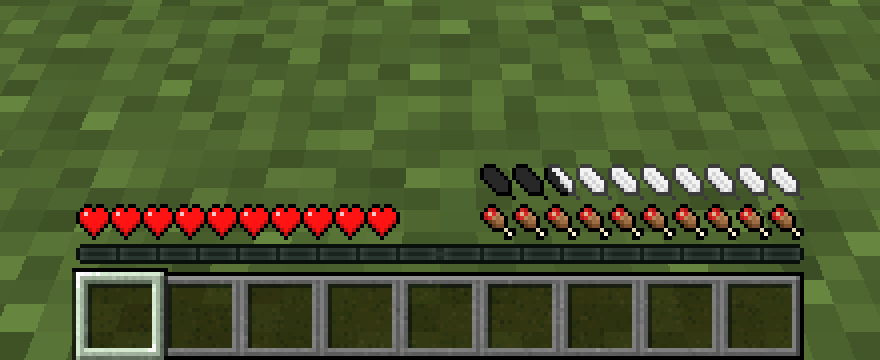 |
|---|---|---|
| Green | Blue | White |

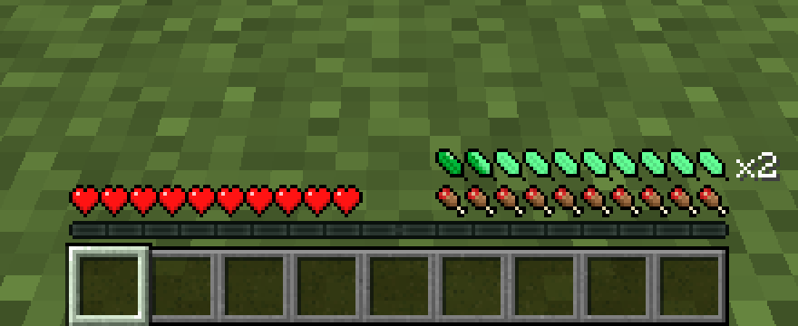

*More than 20 feathers: a second layer over the first, and the count on the right.*

## Strain

When you run out you can keep going into red *strain* feathers, up to a limit (6 by default). Regeneration pays strain back before anything else, slowly, so overdoing it leaves you drained for a while.

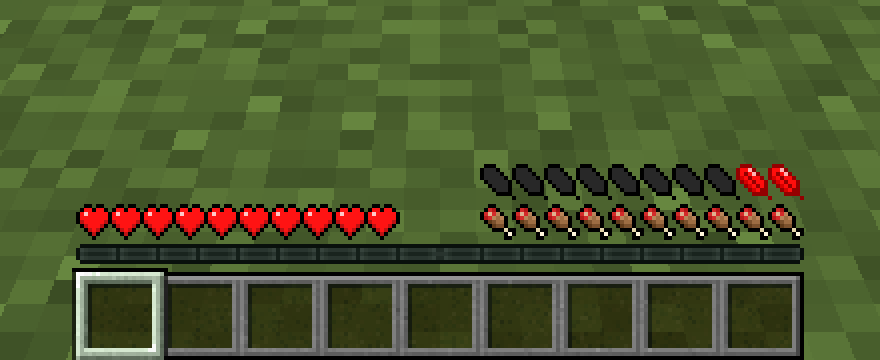

## Exhaustion

Spend absolutely everything (no feathers and no strain room left) and you're exhausted: no exerting yourself until you've regained part of your bar (30% by default) with no strain left.

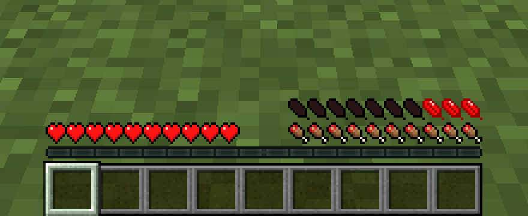

## Resting

Standing still, crouching or sitting down (a boat, a horse, or most seats from furniture mods) pays strain back faster. Sleeping through the night restores everything, also when a sleep mod skips the night for you. Leaving the bed before morning restores nothing.

## Food (optional)

A well-fed body recovers faster: with a full food bar and saturation left, feathers come back quicker (`saturation_regen_bonus` in the server config). Go hungry, 6 hunger points (3 drumsticks) or less, and they come back slower (`hunger_regen_penalty`). Both are off by default. Only players eat; mounts are unaffected.

With `regen_uses_hunger` on, regenerating costs food like healing does, and stops altogether once you're that hungry.

## Weather and climate

- **Cold** weather slows your recovery.
- **Heat** makes everything cost double.
- **The Nether, fire and lava** also cut your maximum feathers (fatigue).
- **Fire Resistance** or a **Potion of Cooling** keeps you fresh.

With a temperature or seasons mod installed, that mod decides when you're cold or hot (see [Compatibility](Compatibility)).

| 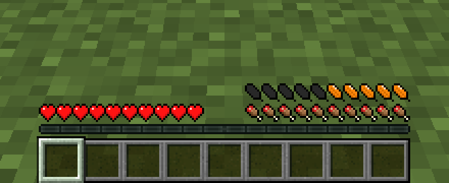 | 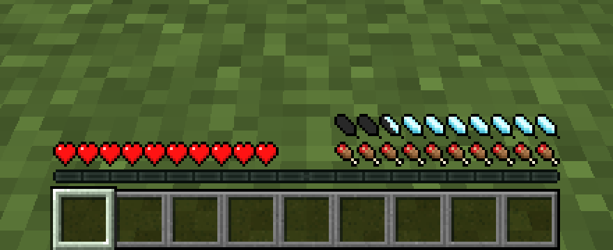 | 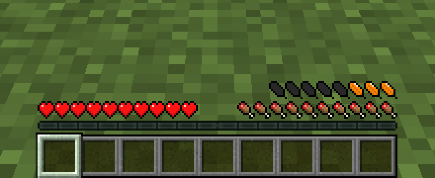 |
|---|---|---|
| Hot: everything costs double | Cold: slower recovery | Fatigued: 4 feathers fewer |

## Armor weight (optional)

Every armor piece holds back some feathers you can't use. They are drawn from the right, head to feet, each in its piece's own color (leather in its dye). Netherite is heavy.

- The **Lightweight** enchantment takes 25% off a piece per level.
- The **Feather Ring** (a Curios ring, or held in the off hand without Curios) halves the weight.
- Other mods can add weight of their own, such as a backpack, drawn after the boots in its own colors.

Turn it on with `armor_weights_enabled` in the server config.

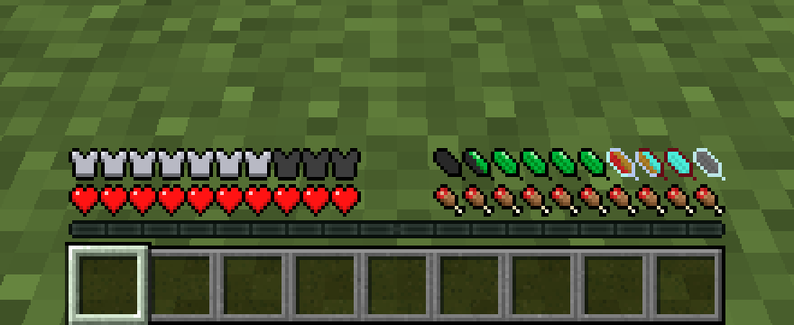

*Iron helmet, diamond chestplate, gold leggings and red leather boots: each piece holds back feathers in its own color.*

## Mounts (optional)

Horses, donkeys, mules and camels have their own feathers, shown instead of yours while you ride, in the colors of the animal you're on. Galloping and jumping tire them slowly; an exhausted mount slows down and can't jump. A jump the mount can't pay for doesn't happen.

Like speed and health, each animal is born with its own stamina (14 to 30 feathers by default), and foals take after their parents. Horse armor weighs a little: leather and gold 1 feather, iron and diamond 2.

Modpacks can give feathers to other creatures (see [Modpack Makers](Modpack-Makers)).

| 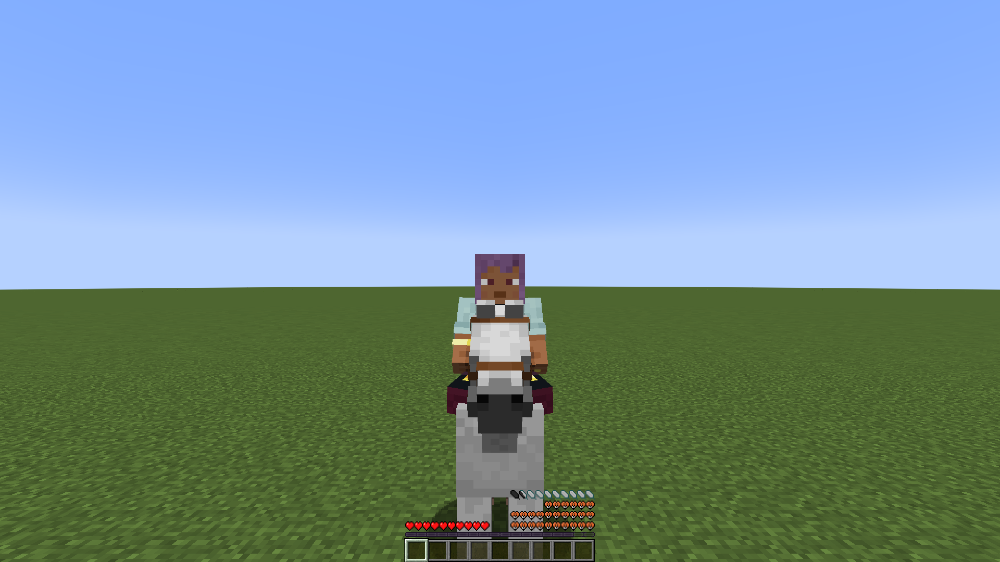 | 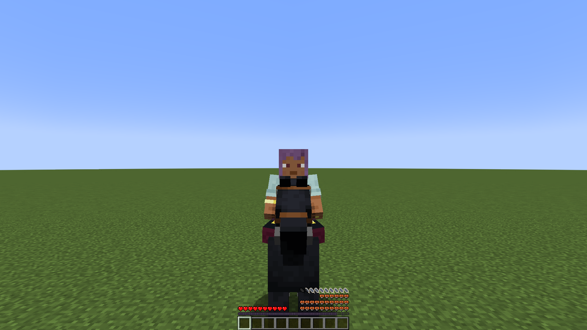 |
|---|---|
| A white horse | A black horse |
| 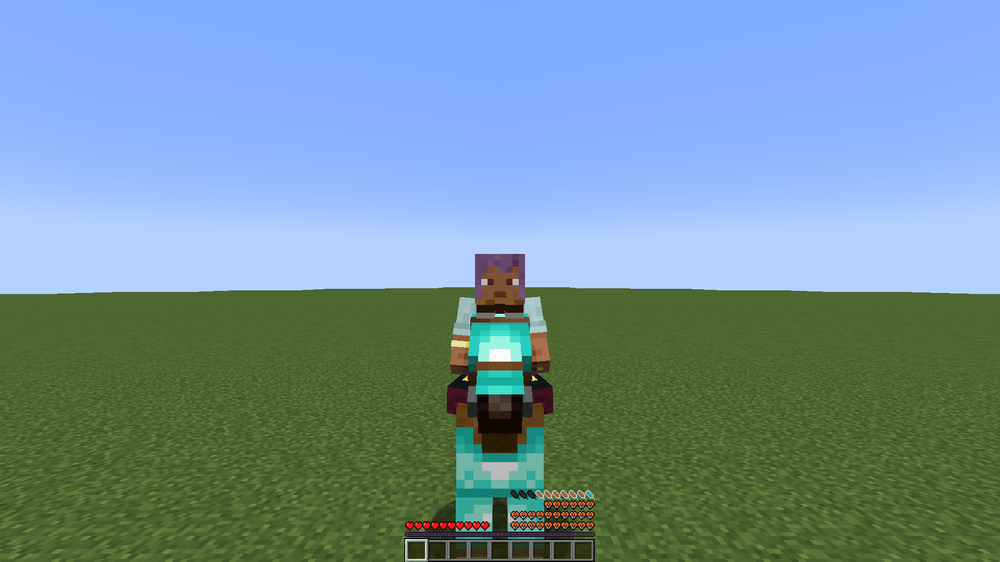 | 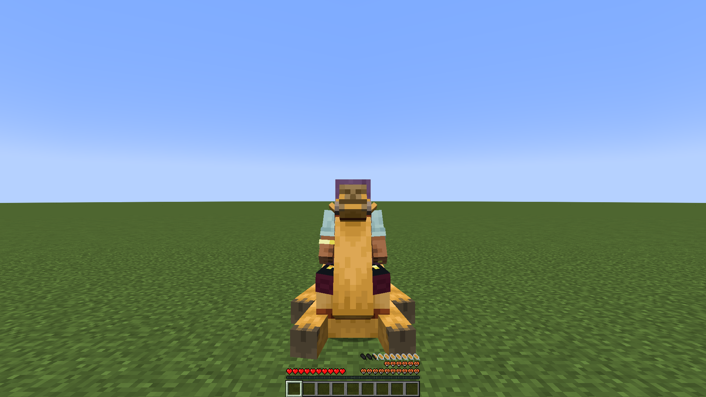 |
| Diamond horse armor weighs 2 feathers | A camel |

## Potions

| Potion | Effect |
|---|---|
| Endurance | A row of golden bonus feathers on top of your own; drinking it again extends what is left instead of refilling it |
| Energy | Faster recovery |
| Momentum | Cheaper actions |
| Cooling | Protects from heat |

| 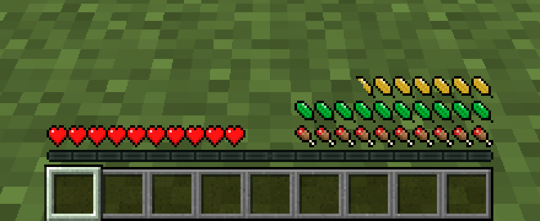 | 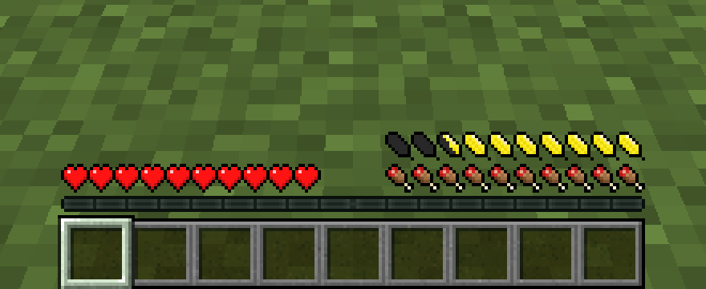 | 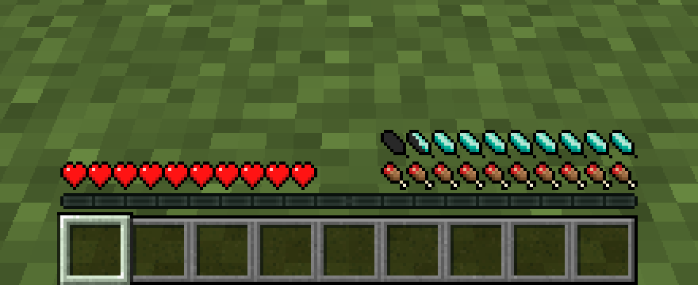 |
|---|---|---|
| Endurance | Energized | Momentum |
